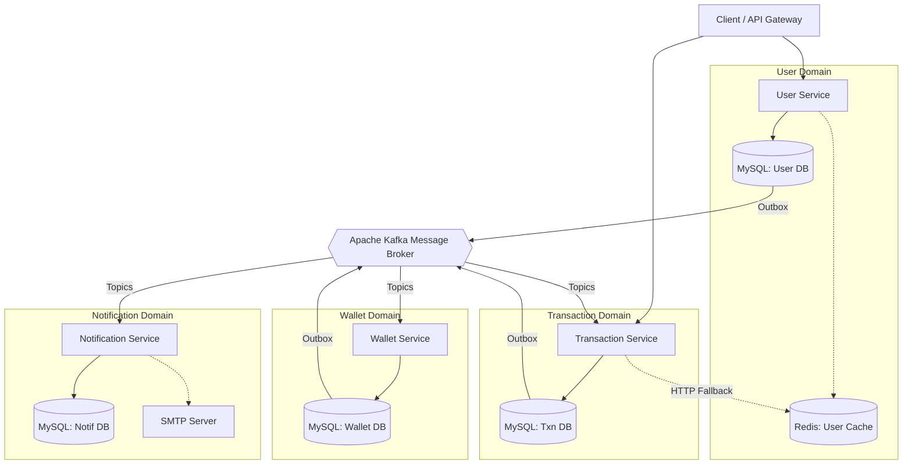

# Solution Design Document: E-Wallet Distributed System

## 1. Executive Summary
The E-Wallet platform is a highly scalable, fault-tolerant, event-driven microservices architecture designed to handle financial transactions. The system is decoupled into four independent domains, communicating asynchronously via Apache Kafka. It implements the **Choreography Saga Pattern** for distributed transactions, ensuring high availability and strict data consistency without relying on distributed locks (Two-Phase Commits).

---

## 2. Component Architecture

---

## 3. Core Resilience & Scalability Patterns

As a financial system, data integrity is the highest priority. The following enterprise patterns are implemented:

### 3.1. The Transactional Outbox Pattern (Event Consistency)
* **Problem:** If a microservice saves data to MySQL but crashes before publishing the event to Kafka, the distributed system becomes permanently inconsistent.
* **Solution:** Services do *not* write directly to Kafka. Instead, they write business data (e.g., `Wallet`) and event data (e.g., `WalletOutboxEvent`) into two separate tables within the **exact same Local MySQL Transaction**. If either fails, MySQL rolls back both. A separate background worker (`@Scheduled`) safely polls the outbox table and guarantees "At-Least-Once" delivery to Kafka.

### 3.2. Idempotent Consumers (Duplicate Handling)
* **Problem:** Kafka's "At-Least-Once" delivery guarantee means network timeouts can cause duplicate messages. 
* **Solution:** The `wallet-service` maintains a `processed_wallet_transactions` database table. Before deducting funds, it checks if the Kafka message's unique `txnId` has already been processed. If a duplicate arrives, it is safely ignored. Users are mathematically guaranteed to never be charged twice.

### 3.3. Cache-Aside with Graceful Degradation (High Availability)
* **Problem:** The `transaction-service` needs user emails to process a transfer. If `user-service` experiences an outage, transactions would fail.
* **Solution:** When a user registers, their profile is instantly cached in an independent Redis cluster. If `transaction-service` cannot reach `user-service` via HTTP (enforced via Spring `@Retryable`), it triggers a `@Recover` fallback method. It bypasses the dead service, fetches the email directly from Redis, and processes the transaction without the user ever noticing an outage.

### 3.4. Dead Letter Topics (Poison Pill Prevention)
* **Problem:** If `wallet-service` attempts to process a transaction but the Wallet DB crashes, the message will fail. Kafka strictly orders partitions, so this failing message will freeze the entire queue, halting all global transactions.
* **Solution:** Spring Kafka is configured with a `FixedBackOff(1000L, 3L)`. It retries the failing database query 3 times. If it still fails, a `DeadLetterPublishingRecoverer` automatically routes the message out of the main queue and into a `.DLT` (Dead Letter Topic). The main queue instantly unblocks, and engineers can manually replay the `.DLT` queue once the database is repaired.

---

## 4. Chronological Business Flows

### 4.1. User Onboarding Flow
1. **Client** sends `POST /user` with user details.
2. **UserService** initiates a local DB transaction. It saves the User profile and saves a `user_create` event into the Outbox table. It commits the transaction.
3. **UserService** immediately caches the user's email into **Redis**.
4. **UserService** background thread reads the Outbox and publishes `user_create` to Kafka.
5. **WalletService** consumes `user_create`, initiates a local DB transaction, and creates an empty Wallet (Balance: 100) linked to the `userId`.

### 4.2. Saga Orchestration Flow (Transferring Funds)
1. **Client** sends `POST /txn` (amount, senderId, receiverId) to **TransactionService**.
2. **TransactionService** requests emails from **UserService** (with Redis fallback if down).
3. **TransactionService** initiates a local DB transaction: creates the Transaction (Status: `PENDING`) and saves a `txn_create` Outbox event.
4. **TransactionService** Outbox publisher pushes the event to Kafka.
5. **WalletService** consumes `txn_create`. 
6. **WalletService** verifies Idempotency (checking `processed_wallet_transactions`).
7. **WalletService** initiates a local DB transaction: It verifies balances. If valid, it deducts from the sender, adds to the receiver, saves the Idempotency record, and saves a `wallet_update` Outbox event (Status: `SUCCESS`). If invalid, it saves a `wallet_update` Outbox event (Status: `FAILED`).
8. **WalletService** Outbox publisher pushes the event to Kafka.
9. **TransactionService** consumes `wallet_update`. It updates the local DB Transaction status to `SUCCESS` or `FAILED`, and publishes a `txn_complete` Outbox event.
10. **NotificationService** consumes `txn_complete`. It generates an email body and pushes it to its own DB Outbox. A polling publisher reads the draft and dispatches it via the SMTP server to the user.
